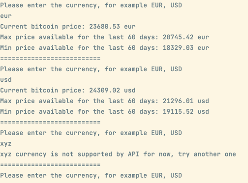

# Getting Started
A command-line Java program that fetches data from the following public APIs:
- https://api.coindesk.com/v1/bpi/historical/close.json?start=2013-09-01&end=2013-09-05&currency=eur 
- https://api.coindesk.com/v1/bpi/currentprice/eur.json

Program requests the user to input a currency code (USD, EUR, GBP, etc.) and provides the following information if available:
- The current Bitcoin rate, in the requested currency
- The lowest Bitcoin rate in the last 60 days, in the requested currency
- The highest Bitcoin rate in the last 60 days, in the requested currency

# Running
## Building image and running
1. Make sure Docker desktop is installed & running
2. Stop and remove existing containers `docker-compose down --rmi all`
3. Start and infrastructure locally in docker compose `docker-compose run --rm crypto-price-portal --force-recreate`

## Just running
To run recently published image, perform the following command:
`docker run -it tandryukha/crypto-price-portal:1.0`

# Development
To package and run tests execute `./mvnw clean package`

# Implementation details
A lightweight java console app that uses minimum required libraries and frameworks to KISS

# Further improvements
- Customization with env variables